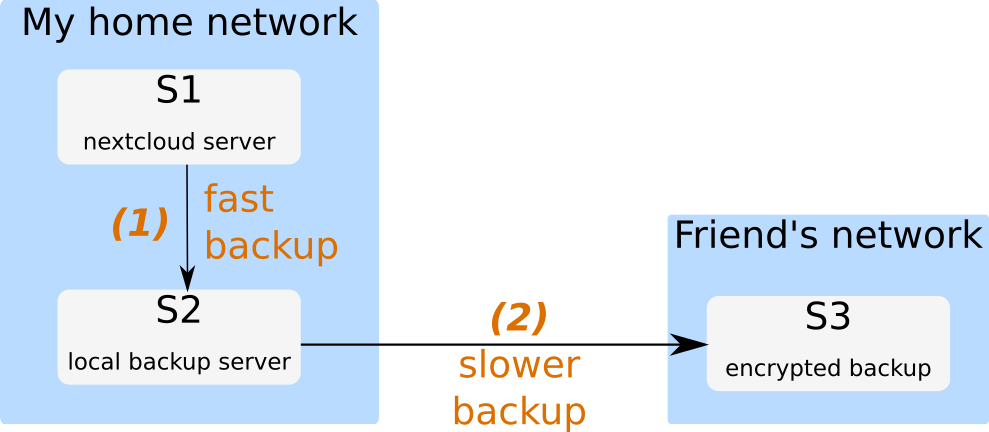

# Backup of a Nextcloud instance

This backs up the data, the HTML directory and the associated PostgreSQL database of a Nextcloud instance.  We follow the 3-2-1 scheme: 3 copies, including one off-site. 

## Requirements

The following is required of my backup procedure:

- minimizes the downtime of the Nextcloud instance,
- produces at least one local copy and one encrypted off-site copy,
- is incremental,
- is automated and occurs daily. 

These are achieved using the following tools:

- `rsync` with hard links,
- `SSH` and `SSHFS` between the different servers,
- a `LUKS` encrypted file container stored on the off-site server.

## Flow

The backup occurs in two steps. First, a local backup script is ran on the server `S1` to a local backup server `S2`. This first part is fast in the sense that it does not depend on the quality of the internet connection. 



At this point the Nextcloud instance can continue operation on `S1`. The second step is off-site and thereby slower in my case (slow upload speed). This time the backup is copied to a `LUKS` encrypted file container stored on the server `S3`, outside of our home network.  The `S3` filesystem is mounted locally on `S2` using `SSHFS`, which allows for a decryption of the `LUKS` image directly  on `S2`. This way, the decryption key is only needed on `S2`: the server `S3` can never read our files. Moreover, the copy itself occurs over `SSH` and is by nature encrypted as well. 

## Setup

### Creating and mounting the `LUKS` image

```bash
# ssh into your remote server
ssh S3 # or prepare this locally and then plug the hard drive in on S3, same story
cd /your/mass/storage
# reserve the amount of space that you will need
dd if=/dev/zero of=your_luks_image.img bs=1 count=0 seek=776G
# create the LUKS volume
sudo cryptsetup luksFormat your_luks_image.img /path/to/yourkey.keyfile
# decrypt it.
sudo cryptsetup luksOpen your_luks_image.img yourMapperName --key-file /path/to/yourkey.keyfile
# format it with ext4
sudo mkfs.ext4 /dev/mapper/yourMapperName
```

## Running the scripts

You will need root access on the three servers involved in the backup. `S1` must be able to `SSH` into `S2` and `S2` into `S3`. Get a copy of the scripts on `S1` and on `S2` with 

```bash
git clone git@github.com:duxfrederic/nextcloud-backup.git
```

Then, adapt `src/backup.config`  to your situation. On `S1`,  setup a crontab (as root) with e.g.

```crontab
30 03 * * *  /path/to/S1_main.sh >  /path/to/logs 2>&1
```

that is run daily at 03:30. With my two Raspberry Pis, low end USB hard drives and ~500 GB Nextcloud instance, this step takes 30 minutes in average. On `S2`:

```crontab
33 4,5,6 * * *  /path/to/S2_encrypted_backup.sh >  /path/to/logs 2>&1
```

which tries to start the second part of the backup a few times. (It does so once only if the first part is successful, so you could just run that one every hour). 

> Recall, the first run will be massively slower than the subsequent ones. 

## Things that could be improved

- Right now, the `S2` script must be ran as root. Since I don't want to `SSH` as root from `S1`, the `S1` script simply leaves a signal file on `S2` once the first backup is completed. The `S2` script is triggered by a crontab regularly checking for this specific file. This could be improved with some `visudo` magic on `S2`, such that the second step can be triggered by a non root user directly from `S1`.
- The database is dumped to `/tmp` on `S1` - it can be read by a non-root user while it is there. If this is a problem, the dump location can probably be changed to e.g. the home directory of `postgres`.
- Rotation of the older backups. Very easy to implement, but I do not need it just yet because each increment is so light. 

